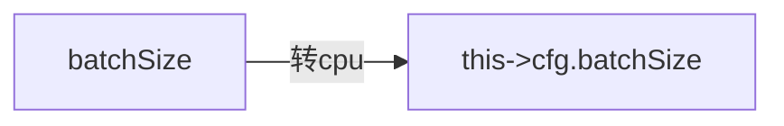
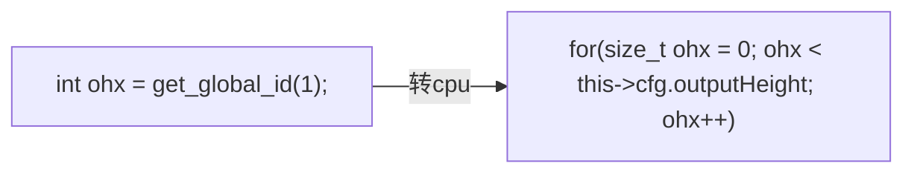

# OCL-ENGINE的CPU Debug调试接口适配

    哈哈哈，这段时间有些空闲时间去完善OCLEngine工程，所以有些高产。
    为了验证核心函数的正确性，本次主要完善之前预留的cpu推理调试接
    口。同样是以Conv2d和Pool2d算子适配工作为主。


### 1、前言


本次的进展内容：
- 在engine.hpp中增加了余弦相似度计算模板函数
- 增加了InferenceDebugByCpu调试推理接口
- 仿照了对应的cl核函数实现，适配了卷积(Conv2d)算子和池化(Pool2d)算子的cpu_run调试接口

本次文章的主要内容：
- 介绍余弦相似度计算函数的实现细节
- InferenceDebugByCpu调试推理接口的调用流程和具体实现
- cpu_run调试推理部分如何从cl核函数转换


### 2、介绍余弦相似度计算函数的实现细节

#### 2.1、模板函数实现

```c++
/*----------------------quadraticSum函数用途-------------------------------*/
    //用途：这是一个归一化的函数，将输出特征进行归一化操作
    template <typename T>
    void quadraticSum(T* packFeature, size_t fea_size)
    {
        double squre = 0.0;
        for (size_t i = 0; i < fea_size; i++)
        {
            squre += (double)(packFeature[i] * packFeature[i]);
        }
        double root = std::sqrt(squre);
        for (size_t i = 0; i < fea_size; i++)
        {
            packFeature[i] = (T)(packFeature[i]/root);
        }

        return;
    }


    /*----------------------CosineSimilarity函数用途-------------------------------*/
    template <typename T>
    double CosineSimilarity(T* fea1, T* fea2, size_t fea_size)
    {
        double product = 0.0;
        quadraticSum(fea1, fea_size);
        quadraticSum(fea2, fea_size);

        for (size_t i = 0; i < fea_size; i++)
        {
            product = product + (double)(fea1[i] * fea2[i]);
        }
        return 0.5 * product + 0.5;
    }

```


### 3、InferenceDebugByCpu调试推理接口

#### 3.1、调用流程

具体的调用流程示例如下所示：
```c++
    // 首先进行一次OCLEngine的opencl推理，其内部会把计算好的结果放入到对应的cl_mem对象中
    OCLEngine::Inference();
    // 如果设置了异步推理，需要进行WaitFinish等待命令队列的所有命令结束
    if(OCLEngine::WaitFinish() == false){
        printf("error when waiting finish\n");
    }
    // 最后才调用InferenceDebugByCpu()进行cpu的相关调试推理
    OCLEngine::InferenceDebugByCpu();
```

#### 3.2、实现细节

具体的调用流程示例如下所示：
```c++
    /* 进行推理的接口 */
    bool InferenceDebugByCpu(){
        /* 配合上述Inference接口使用，确保cl_mem数据全部被赋值，同时没被使用 */
        for(size_t i = 0; i < AllLayers.size(); i++){
            AllLayers[i]->cpu_run();//调用了算子的cpu_run实现
        }
        return true;
    }
```


### 4、cpu_run调试推理部分如何从cl核函数转换

#### 4.1、关于opencl的cl核函数说明

- cl核函数内部遵循了C99编程语言标准，内部的代码跟C语言一致；
- cl核函数内部的逻辑只代表一个工作项的所有工作，具体的循环是靠外部调用clEnqueueNDRangeKernel函数时设置的globalWorkSize去切分；

#### 4.2、从cl核函数转换成Cpu推理代码的流程

- 1、变量替换：cl的传参用外部变量替换



- 2、预编译替换：cl的预编译用条件语句替换


- 3、显示循环：cl的工作项用cpu循环语句替换




### 5、精度测试

测试条件跟上次的一致，测试结果如下所示：
```bash
conv2d CosineSimilarity value = 99.9999972397
pool2d CosineSimilarity value = 99.9999996682
inference time is 54.398 fps
```

结果显示：两个算子的精度都在百分比精度的第6位，说明精度已经分别高了。

### 6、工程源码下载
可直接访问该网址[https://github.com/pengzhikang/Custom-Model.git](https://github.com/pengzhikang/Custom-Model.git)

```bash
git clone -b OCLEngine https://github.com/pengzhikang/Custom-Model.git
```


### 7、后续计划与安排

如下所示：
- 适配更多常用算子：常见激活算子relu、sigmoid等
- 模型转换工具：需要编写一个模型转换工具去转换比如pytorch或者是caffe，甚至是darknet的训练前端模型到自定义的模型上。
- 其他：异构推理（调度多计算设备去同时进行一次推理）、量化支持等