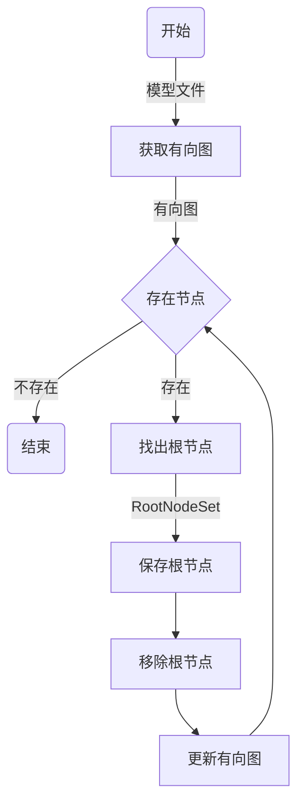
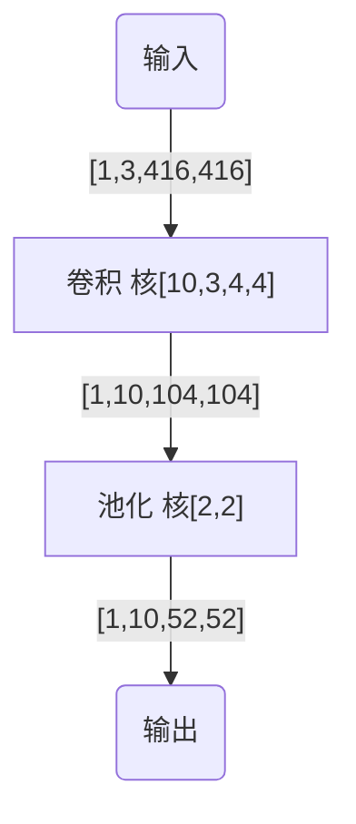

# OCL-ENGINE工程介绍

    《你或许也想拥有专属于自己的AI模型文件格式》这个系列，上一次的文章更新是2022-03-05，距今已经4个月之久了。
    
    主要是这段时间有其他的事情在忙，期间也在断断续续地在完善该推理框架的。而让我思绪卡死的地方就是整网的推理时
    事件依赖问题，这个问题主要是因为OpenCL的clEnqueueNDRangeKernel这个核函数推理函数的局限性问题（正文仔细说明）。


### 1、前言


本次的进展内容：
- 完成了整网的推理时框架构建
- 根据有向图重排了网络的网络层推理顺序
- 根据重排后的网络层的有向图形成了事件依赖
- 适配了卷积(Conv2d)算子和池化(Pool2d)算子（编写.cl核函数以及相关适配代码）

本次文章的主要内容：
- 有向图重排网络层的核心算法
- 算子适配的过程以及核函数的具体实现(以Conv2d为例)
- 初次测试推理框架的推理速度性能

目前的工程整体结构：

```
.
|-- 3rdparty
|   `-- flatbuffers
|       |-- bin
|       |   `-- flatc.exe
|       |-- include
|       |   `-- flatbuffers
|       `-- lib
|           |-- debug
|           `-- release
|-- CMakeLists.txt
|-- README.md
|-- build
|-- clkernel
|   |-- conv2d.cl
|   |-- img2col.cl
|   `-- pool2d.cl
|-- example
|   |-- create_model_sample.cpp
|   `-- main.cpp
|-- include
|   |-- CL
|   |-- model
|   |   |-- json11.hpp
|   |   |-- pzk-schema_generated.h
|   |   `-- pzk.hpp
|   `-- runtime
|       |-- builder.hpp
|       |-- engine.hpp
|       |-- img2col.hpp
|       `-- op
|           |-- allops.hpp
|           |-- conv2d.hpp
|           |-- img2col.hpp
|           `-- pool2d.hpp
|-- model-flatbuffer
|   |-- pzk-metadata.json
|   `-- pzk-schema.fbs
|-- run.sh
|-- src
|   |-- model
|   |   `-- json11.cpp
|   `-- runtime
`-- test-model
    `-- first.pzkm
```

### 2、有向图重排网络层

#### 2.1、重排的原因和目的

- 模型的网络层顺序是乱序的：我们自定义的模型中，对应网络层的顺序没有任何要求。因此根据原始的网络层顺序去构建整网的推理时，那么必然会导致推理顺序出现问题，这很可能会导致卡死、结果出错的问题。
- 重排网络层有利于形成核函数执行时的事件依赖：也就是如果不进行网络层重排，对于clEnqueueNDRangeKernel的事件依赖参数就无法正确给出，这样我们就无法对推理框架形成异步推理接口。注重事件依赖的原因是：事件依赖保证了网络层的执行顺序，而保证了最终结果的正确性。

#### 2.2、重排的核心思想

    如标题所示，重排网络层用到的主要思想就是有向图。而具体的方法是：
- 1、用有向图抽象出了网络层之间的连接关系，尤其是数据流的流向关系，也就是剥离了网络层的输入输出依赖关系；
- 2、找出现在有向图中的所有的根节点RootNodeSet（也就是只有输出没有输入的节点）
- 3、这些RootNodeSet作为一个整体部分，作为事件依赖的一个整体节点
- 4、去掉现有有向图中的这部分RootNodeSet
- 5、更新有向图
- 6、如果有向图还有节点，则重复2-5步骤；否则，结束。

对应的流程图如下所示：



#### 2.3、具体的代码如下所示

```c++
    /* 返回重排结果的标号信息 */
    std::vector<size_t> ReSortByDirectedGraph(std::vector<std::vector<bool>> DirectedGraph){
        /* 运用的主要原理是根节点只有输出没有输入的特性;
            通过不断去除掉根节点，更新有向图，然后进行操作的时候
        */
        std::vector<size_t> ReSortIndex;
        std::vector<size_t> RemainIndex;
        std::vector<size_t> RegIndex;
        std::vector<size_t> Reg2Index;
        std::vector<std::vector<bool>> BakDirectedGraph = DirectedGraph;
        for(size_t i = 0; i < DirectedGraph.size(); i++){
            RemainIndex.push_back(i);
        }
        /* 1.开始进行根节点获取操作 */
        ReSortIndex = JudgeRootNode(DirectedGraph);
        /* 2. 移除RemainIndex中的重复点 */
        RemainIndex = MinusSet(RemainIndex, ReSortIndex);
        BakDirectedGraph = RemoveDirectedGraph(BakDirectedGraph, ReSortIndex);
        /* 3. 重复上述两个步骤,直到BakDirectedGraph中不存在节点或者是RemainIndex中没有值 */
        while(RemainIndex.size() > 0 && BakDirectedGraph.size() > 0 && ReSortIndex.size() < DirectedGraph.size()){
            Reg2Index.clear();
            RegIndex = JudgeRootNode(BakDirectedGraph);
            /* 加入到ReSortIndex中 */
            for(auto i:RegIndex){
                ReSortIndex.push_back(RemainIndex[i]);
                Reg2Index.push_back(RemainIndex[i]);
            }
            RemainIndex = MinusSet(RemainIndex, Reg2Index);
            BakDirectedGraph = RemoveDirectedGraph(BakDirectedGraph, RegIndex);
        }
        return ReSortIndex;
    }

```

### 3、算子适配过程（以Conv2d算子作为具体说明）

#### 3.1、跟整体推理框架的接入

- 1、cl算子编写在clkernel文件夹内（比如clkernel/conv2d.cl）

- 2、在include/runtime/op中增加算子头文件（比如conv2d.hpp）

```c++
#include "runtime/engine.hpp"

namespace OCLEngine{
    struct Conv2dCfg{
        cl_mem* input = NULL;
        cl_mem* weights = NULL;
        cl_mem* biases = NULL;
        cl_mem* output = NULL;
        NodeEvent event;
        uint batchSize = 1;
        uint inputChannels;
        uint inputWidth;
        uint inputHeight;
        uint kernelWidth;
        uint kernelHeight;
        uint padTop = 0;
        uint padRight = 0;
        uint padBottom = 0;
        uint padLeft = 0;
        uint strideX;
        uint strideY;
        size_t outputChannels;
        size_t outputHeight;
        size_t outputWeight;
    };

    class Conv2dLayer : public CLFunction{
    private:
        Conv2dCfg cfg;
        cl_kernel kernel = NULL;
        size_t* globalWorkSize = NULL;
        size_t* localWorkSize = NULL;
        cl_uint work_dim = 0;
        bool useful = false;
        cl_int Conv2derrNum = CL_SUCCESS;
    public:
        Conv2dLayer() = default;
        ~Conv2dLayer(){
            if (this->globalWorkSize != NULL){
                free(this->globalWorkSize);
            }
            if (this->localWorkSize != NULL){
                free(this->localWorkSize);
            }
            if (this->kernel != NULL){
                clReleaseKernel(kernel);
            }
        };
        // 配置函数
        bool configure(Conv2dCfg conf){
            this->cfg  = conf;
            std::vector<std::string> buildOptions;
            if (this->cfg.biases != NULL){
                /* 如果有bias，则进行如下所示的编译命令 */
                buildOptions.push_back(std::string("-D HASBIAS"));
            }
            /* 1、获取对应的核心 */
            this->kernel = ProgramManager.GetKernel(std::string("conv2d.cl"), buildOptions, std::string("convolutionNaive"));
            if (this->kernel == NULL){
                printf("Get convolutionNaive kernel of conv2d.cl Failed\n");
                return false;
            }
            /* 2、对核心进行相应的参数设置 */
            cl_uint arg_idx = 0;
            Conv2derrNum = clSetKernelArg(kernel,arg_idx,sizeof (cl_mem),
                                    this->cfg.input);
            Conv2derrNum |= clSetKernelArg(kernel,++arg_idx,sizeof (uint), this->cfg.weights);
            if (this->cfg.biases != NULL)
                Conv2derrNum |= clSetKernelArg(kernel,++arg_idx,sizeof (cl_mem),this->cfg.biases);
            Conv2derrNum |= clSetKernelArg(kernel,++arg_idx,sizeof (uint),&(this->cfg.batchSize));
            Conv2derrNum |= clSetKernelArg(kernel,++arg_idx,sizeof (uint),&(this->cfg.inputChannels));
            Conv2derrNum |= clSetKernelArg(kernel,++arg_idx,sizeof (uint),&(this->cfg.inputWidth));
            Conv2derrNum |= clSetKernelArg(kernel,++arg_idx,sizeof (uint),&(this->cfg.inputHeight));
            Conv2derrNum |= clSetKernelArg(kernel,++arg_idx,sizeof (uint),&(this->cfg.kernelWidth));
            Conv2derrNum |= clSetKernelArg(kernel,++arg_idx,sizeof (uint),&(this->cfg.kernelHeight));
            Conv2derrNum |= clSetKernelArg(kernel,++arg_idx,sizeof (uint),&(this->cfg.padTop));
            Conv2derrNum |= clSetKernelArg(kernel,++arg_idx,sizeof (uint),&(this->cfg.padRight));
            Conv2derrNum |= clSetKernelArg(kernel,++arg_idx,sizeof (uint),&(this->cfg.padBottom));
            Conv2derrNum |= clSetKernelArg(kernel,++arg_idx,sizeof (uint),&(this->cfg.padLeft));
            Conv2derrNum |= clSetKernelArg(kernel,++arg_idx,sizeof (uint),&(this->cfg.strideX));
            Conv2derrNum |= clSetKernelArg(kernel,++arg_idx,sizeof (uint),&(this->cfg.strideY));
            Conv2derrNum |= clSetKernelArg(kernel,++arg_idx,sizeof (cl_mem),this->cfg.output);
            if (Conv2derrNum != CL_SUCCESS){
                printf("Set kernel Arguments Failed On Conv2d Layers\n");
                return false;
            }
            /* 3、 设置全局尺寸和局部尺寸大小，以便于后续的加入命令队列操作 */
            this->work_dim = 3;
            this->globalWorkSize = (size_t*)malloc(sizeof(size_t) * this->work_dim);
            this->globalWorkSize[0] = this->cfg.batchSize * this->cfg.outputChannels;
            this->globalWorkSize[1] = this->cfg.outputHeight;
            this->globalWorkSize[2] = this->cfg.outputWeight;
            this->localWorkSize = (size_t*)malloc(sizeof(size_t) * this->work_dim);
            this->localWorkSize[0] = 1;
            this->localWorkSize[1] = 1;
            this->localWorkSize[2] = 1;
            useful = true;
            return true;
        };
        // 重载函数，主要的run函数
        void run() override{
            if (this->useful){
                this->Conv2derrNum = clEnqueueNDRangeKernel(commandQueue,
                                                            this->kernel,
                                                            this->work_dim,
                                                            NULL,
                                                            this->globalWorkSize,
                                                            this->localWorkSize,
                                                            this->cfg.event.wait_event.num,
                                                            this->cfg.event.wait_event.event,
                                                            this->cfg.event.this_event.event);
                if (this->Conv2derrNum != CL_SUCCESS){
                    printf("Inference Conv2d Layers Failed\n");
                    return;
                }
            }else{
                printf("This Conv2d Layers is useless\n");
                return;
            }
        };
        /* cpu推理函数，主要用于测试 
            此时，因为其父类拥有这个
        */
        void cpu_run() override{

        };
    };
}
```


- 3、在include/runtime/op/allops.hpp中新增对接代码

```c++
/* 2.1、增加对应算子头 */
#include "runtime/op/conv2d.hpp"
#include <memory>
namespace OCLEngine{
    /* ... */
    /* 2.2、conv2d网络层的构建 */
    bool add_conv2d_layer(layer_maker l, NodeEvent node_event, std::vector<TensorsS> input, std::vector<TensorsS> output){
        Conv2dCfg cfg;
        cfg.input = l.get_input_id("input") != -1 ? &(clmem[l.get_input_id("input")]):NULL;
        cfg.weights = l.get_input_id("weights") != -1 ? &(clmem[l.get_input_id("weights")]):NULL;
        cfg.biases = l.get_input_id("biases") != -1 ? &(clmem[l.get_input_id("biases")]):NULL;
        cfg.output = l.get_output_id("conv2d-output") != -1 ? &(clmem[l.get_output_id("conv2d-output")]):NULL;
        if (cfg.input == NULL || cfg.weights == NULL || cfg.output == NULL){
            return false;
        }
        cfg.event = node_event;
        TensorsS input_tensor = input[find_tensor_by_id(input, l.get_input_id("input"))];
        cfg.batchSize = input_tensor.shape.dims[0];
        cfg.inputChannels = input_tensor.shape.dims[1];
        cfg.inputHeight = input_tensor.shape.dims[2];
        cfg.inputWidth = input_tensor.shape.dims[3];
        TensorsS weight_tensor = input[find_tensor_by_id(input, l.get_input_id("weights"))];
        cfg.kernelHeight = weight_tensor.shape.dims[2];
        cfg.kernelWidth = weight_tensor.shape.dims[3];
        cfg.padTop = l.get_attr<uint>(std::string("padTop")).size() == 0 ? 0:l.get_attr<uint>(std::string("padTop"))[0];
        cfg.padRight = l.get_attr<uint>(std::string("padRight")).size() == 0 ? 0:l.get_attr<uint>(std::string("padRight"))[0];
        cfg.padBottom = l.get_attr<uint>(std::string("padBottom")).size() == 0 ? 0:l.get_attr<uint>(std::string("padBottom"))[0];
        cfg.padLeft = l.get_attr<uint>(std::string("padLeft")).size() == 0 ? 0:l.get_attr<uint>(std::string("padLeft"))[0];
        cfg.strideX = l.get_attr<uint>(std::string("strideX")).size() == 0 ? cfg.kernelWidth:l.get_attr<uint>(std::string("strideX"))[0];
        cfg.strideY = l.get_attr<uint>(std::string("strideY")).size() == 0 ? cfg.kernelHeight:l.get_attr<uint>(std::string("strideY"))[0];
        TensorsS output_tensor = output[find_tensor_by_id(output, l.get_output_id("conv2d-output"))];
        cfg.outputChannels = output_tensor.shape.dims[1];
        cfg.outputHeight = output_tensor.shape.dims[2];
        cfg.outputWeight = output_tensor.shape.dims[3];
        /* 正式构建卷积层 */
        std::shared_ptr<Conv2dLayer> conv2d = std::make_shared<Conv2dLayer>();
        if (conv2d->configure(cfg) == false){
            printf("conv2d make failed\n");
            return false;
        }else{
            AllLayers.push_back(conv2d);
            return true;
        }
    }

    /* 构建运行时的网络层 */
    bool BuildLayers(PzkM model){
        bool ret = true;
        for (size_t i = 0; i < model.rLayers.size(); i++){
            /* 进行各种不同类型的选择 */
            if (onelayer.type == "img2col"){
            }else if (onelayer.type == "Convolution2dLayer"){
                /* 2.2、增加上述函数的调用 */
                ret = add_conv2d_layer(onelayer, node_event, input_tensor, output_tensor);
            }else if (onelayer.type == "Pooling2dLayer"){
            }
            else{
                printf("unknown type = %s layer, cant't finish it\n", onelayer.type.c_str());
                return false;
            }
            /* 查看是否正确与否 */
            if (!ret){
                printf("failed to build type=%s, name=%s Layers\n", onelayer.type.c_str(), onelayer.name.c_str());
                return false;
            }
        }
        return true;
    }
}
```


#### 3.2、CL算子介绍


实际cl核函数如下所示：

```opencl
__kernel
void convolutionNaive(__global const float* input,
            __global const float* weights,
#ifdef HASBIAS
            __global const float* biases,
#endif
            const uint batchSize,
            const uint inputChannels,
            const uint inputWidth,
            const uint inputHeight,
            const uint kernelWidth,
            const uint kernelHeight,
            const uint padTop,
            const uint padRight,
            const uint padBottom,
            const uint padLeft,
            const uint strideX,
            const uint strideY,
            __global float* output
            ){
  int outputChannels = get_global_size(0) / batchSize;
  int outputHeight = get_global_size(1);
  int outputWeight = get_global_size(2);
  /* NC融合进行之后，如何拆分出相应维度
    错误示例如下：
    解释：会导致实际分配不正确，当batchSize=1，OutputChannels=10的时候，发现oc===0，明显出错。
    int b = get_global_id(0) / batchSize;
    int oc = get_global_id(0) % batchSize;
   */
  int b = get_global_id(0) / outputChannels;/* batchSize被融入到第一个并行度中，N*C */
  int oc = get_global_id(0) % outputChannels;
  int ohx = get_global_id(1); // [0, col_chw)
  int owy = get_global_id(2);
  uint output_offset = b * outputChannels * outputHeight * outputWeight + oc * outputHeight * outputWeight + ohx * outputWeight + owy;
  uint input_feature_map_size = inputHeight * inputWidth;
  uint input_one_size = inputChannels * input_feature_map_size;
  uint weight_feature_map_size = kernelWidth * kernelHeight;
  uint weight_one_size = inputChannels * weight_feature_map_size;
// /* 定义一次卷积的长度=kernelWidth乘kernelHeight */
// #define CalSize 10
//   local float input_reg[CalSize];
//   local float weights_reg[CalSize];
  /*
  [ohx, owy]表示输出特征图的x,y点坐标
  我们需要从输出映射到输入的坐标值，需要考虑到Pad的偏移等因素。
  */
  float result = 0.0;
  int padinputWidthMax = padLeft + inputWidth;
  int padinputHeightMax = padBottom + inputHeight;
  int ihx = ohx * strideX;
  int iwy = owy * strideY;
  /* 首先只进行卷积的weight乘加 */
  for (uint i = 0; i < kernelHeight; i++){
    if (ihx + i < padTop || ihx + i >= padinputHeightMax){
        continue;
    }else{
        for (uint j = 0; j < kernelWidth; j++){
            if (iwy + j < padRight || iwy + j >= padinputWidthMax){
                continue;
            }else{
                /* 此时表示没有超出卷积的尺寸范围之外，所以需要进行卷积操作 */
                uint one_featuremap_offset = (ihx + i - padTop) * inputWidth + (iwy + j - padRight);
                uint one_weight_offset = i * kernelWidth + j;
                for (uint ic = 0; ic < inputChannels; ic++){
                    uint input_ptr = b * input_one_size + ic * input_feature_map_size + one_featuremap_offset;
                    uint weight_ptr = oc * weight_one_size + ic * weight_one_size + one_weight_offset;
                    result += (input[input_ptr] * weights[weight_ptr]);
                }
            }
        }
    }
  }
  /* 然后进行bias的相加 */
#ifdef HASBIAS
  result += biases[oc];
#endif
  output[output_offset] = result;
}
```

解释说明：

- 假设卷积层的输出尺寸为[N,C,H,W],并行工作维度设置为3,其工作项数目分别是[N*C,H,W]
- 使用opencl的预编译指令优化和函数：当存在bias权重时，设置HASBIAS开始bias计算
- 一个工作项只处理一个输出数据，实现最大并行度。


#### 3.3、推理性能测试

测试条件如下所示：

- 硬件环境：处理器Intel(R) Xeon(R) Silver 4110 CPU @ 2.10GH，32核心
- 软件环境：Intel-CPU-OpenCL-SDK-64bit，GCC编译，Linux-Ubuntu18.64
- 测试环境：10000次，异步推理，float推理
- 测试模型：如下所示




测试结果如下所示：

```bash
There is no GPU,trying CPU……
Result: open ../model-flatbuffer/pzk-metadata.json success
<-------------------------------------->
DirectedGraph Mat:
False, True , False, False, 
False, False, True , False, 
False, False, False, True , 
False, False, False, False, 
<-------------------------------------->
<-------------------------------------->
DirectedGraph Mat:
False, True , 
False, False, 
<-------------------------------------->
depend of event is 
node=0--->[dpnum=0,dphead=-1,thisid=0]
node=1--->[dpnum=1,dphead=0,thisid=1]
node=2--->[dpnum=1,dphead=1,thisid=2]
node=3--->[dpnum=1,dphead=2,thisid=-1]
inference time is 480.458 fps
```


结果显示：
- 该模型在该cpu上能够实现480fps的帧率，成绩还算不错。
- 使用htop工具可观察出在推理的时候CPU占用率高，所有核心都被利用起来了，适合多核CPU推理。


### 4、后续计划与安排

其实到这一部分，该推理框架已经成形，可以应对众多的算子适配和相应模型推理。但是还有待相应的完善，如下所示：
- 适配更多常用算子：常见激活算子relu、sigmoid等
- 验证算子计算正确性：验证cl核函数是否编写正确
- 模型转换工具：需要编写一个模型转换工具去转换比如pytorch或者是caffe，甚至是darknet的训练前端模型到自定义的模型上。
- 其他：异构推理（调度多计算设备去同时进行一次推理）、量化支持等